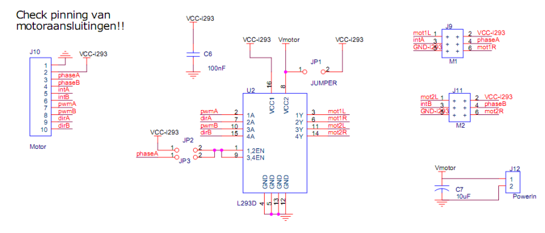

# UniProto Universal Sensor & Actuator Streaming (Arduino / RP2040)

UniProto is a small serial protocol + helper library for:
- **Streaming sensor data** in multiple formats (CSV, Arduino Serial Plotter, debug text, binary frames)
- **Querying and setting parameters** (PID gains, sensor modes, calibration constants, rates)
- **Triggering actions** (zero encoders, stop motors, reset sample blocks)

It is designed to stay **AVR-friendly** (no heap allocations, no `String` required) while also working on faster boards like **RP2040 (Earle Philhower core)**.

---

## Repository structure

Typical layout:

```
lib/
  uniproto/
    UniProto.h
    UniProto.cpp
  uniproto/
    UniWriter.h
    UniWriter.cpp
  modules/
    mod_adc.h
    mod_adc.cpp
    mod_motors.h
    mod_motors.cpp
src/
  main.cpp
```

- **UniProto**: command parser, stream scheduler, registry for streams/params/actions
- **UniWriter**: writers that turn fields into CSV / Plotter / Text / Binary
- **modules/**: self-contained drivers that register streams/params/actions (ADC, motors, etc.)
- **main.cpp**: wiring / config / module registration (kept intentionally clean)

---

## Core concepts

### 1) Streams
A *stream* is a periodic output with:
- `id` (numeric)
- `name` (string label)
- `schema` (human-readable description of payload)
- `units` (human-readable)

Modules register streams in `registerWith(proto)`.

Streams are enabled/disabled via commands and are emitted at the global `rate`.

### 2) Params
A *param* is a named setting:
- `key` (string)
- `type` (`BOOL`, `INT32`, `FLOAT`)
- `get()` and/or `set()` handlers

Params are used for PID gains, sensor modes, calibration constants, etc.

### 3) Actions
An *action* is a named command:
- `name` (string)
- `fn(action, args)` handler

Actions are used for one-shot behaviors like:
- `motor.stop`
- `motor.zero`
- `adc.block_reset`

### 4) Writers / Formats
Modules never print formatting directly. They emit typed fields through a `UniFrameWriter`:
- `u16()`, `i32()`, `f32()`, `bytes()`

UniProto chooses the active writer based on `format`.

Supported formats:
- `csv`  comma-separated numeric fields (good for logging & Python)
- `ap`   Arduino Serial Plotter style `name:value,name:value`
- `txt`  readable debug-style frames
- `bin`  binary frame header + fixed payload (best for blocks)

---

## Command syntax (canonical)

UniProto uses a single, minimal command grammar:

### Capabilities / help
- `?`  
  Prints a JSON 'caps' object listing available streams/params/actions and command grammar.

### Get a value
- `?key`

Examples:
- `?rate`
- `?format`
- `?timestamp`
- `?stream`
- `?motor0.kp`
- `?adc.mode`

Response format:
- `key:value`  
Example: `motor0.kp:3.0000`

### Set a value
- `!key:value`

Examples:
- `!rate:50`
- `!format:csv`
- `!timestamp:1`
- `!stream:3`
- `!motor0.kp:2.5`
- `!adc.mode:3`

Response:
- `OK` on success  
- `ERR <reason>` on failure

### Run an action
- `@action[:args]`

Examples:
- `@motor.stop`
- `@motor.zero`
- `@adc.block_reset`

Response:
- `OK` or `ERR <reason>`

---

## Core keys (built-in)

### `rate`
Global stream emission rate in Hz.

- `?rate`
- `!rate:50`

### `format`
Select writer format:

- `!format:csv`
- `!format:ap`
- `!format:txt`
- `!format:bin`

### `timestamp`
Include timestamps in text/CSV/plotter prefixes and binary headers.

- `!timestamp:0`
- `!timestamp:1`

### `stream`
Enable/disable streams.

- `!stream:0`  disable all
- `!stream:N`  enable only stream N
- `!stream:+N`  enable stream N
- `!stream:-N`  disable stream N

Query current state:
- `?stream`  returns `stream:0` or `stream:1,3,...`

---

## Quick start (minimal main.cpp)

```cpp
#include <Arduino.h>
#include "UniProto.h"
#include "modules/mod_adc.h"
#include "modules/mod_motors.h"

UniProto proto(Serial, "MyNode");

auto adcCfg = AdcModule::defaultUno();
static AdcModule adc(adcCfg);

auto motCfg = DualMotorModule::defaultUno();
static DualMotorModule motors(motCfg);

void setup() {
  Serial.begin(115200);
  while (!Serial) {}

  proto.begin();

  adc.registerWith(proto);
  motors.registerWith(proto);

  Serial.println(F("Ready. Type '?' for caps."));
}

void loop() {
  proto.tick();
}
```

---

## Extending the system

Create a new module pair:
- `lib/modules/mod_xxx.h`
- `lib/modules/mod_xxx.cpp`

A module should:
1. Hold a `Config` struct with pins/defaults
2. Implement `registerWith(UniProto&)`
3. Emit only via `UniFrameWriter`

Keep `main.cpp` limited to wiring and registration.

---

## Build-time tuning

Override defaults in `platformio.ini`:

```ini
build_flags =
  -D UNIPROTO_MAX_PARAMS=18
  -D ADC_BLOCK_LEN=300
  -D ADC_MAX_CH=6
```

---

## Testing tips

- Start with `?`
- Use CSV for Python plotting
- Use BIN only for large blocks
- If Uno resets: reduce params, streams, block size

for memory size check: at top of the code

```cpp
#ifdef ARDUINO_ARCH_AVR
extern unsigned int __heap_start;
extern void *__brkval;
static int freeRam() {
  int v;
  return (int)&v - (__brkval == 0 ? (int)&__heap_start : (int)__brkval);
}
#endif
```

and in ``void setup()``

```cpp
  #ifdef ARDUINO_ARCH_AVR
Serial.print(F("freeRam="));
Serial.println(freeRam());
#endif
```


---

## Python client examples

All Python scripts use the same basic flow:
1) Open the serial port (Arduino Uno typically resets on open; wait ~2s)
2) Send a small 'setup sequence' using UniProto commands
3) Read lines (CSV / plotter / text) or binary frames (blocks)
4) Plot or log

### Common serial helper (recommended)
Most scripts benefit from a tiny helper pattern:

- Open `pyserial.Serial(port, baud, timeout=...)`
- `time.sleep(2.0)` after opening (Uno reset)
- `ser.reset_input_buffer()` to drop boot noise
- Send commands with `\n` terminator

Typical setup snippet (CSV stream):

```python
import time, serial

ser = serial.Serial(port, 115200, timeout=0.2)
time.sleep(2.0)
ser.reset_input_buffer()

def send(cmd):
    if not cmd.endswith("\n"):
        cmd += "\n"
    ser.write(cmd.encode("utf-8"))
    ser.flush()
    time.sleep(0.05)

send("!format:csv")
send("!timestamp:0")
send("!rate:50")
send("!stream:3")
```

### `plot_motor_stream.py`
Purpose: quick live plotting of the **motor telemetry stream** (typically stream id 3).

Typical command sequence:
- `!format:csv`
- `!rate:<Hz>`
- `!stream:3`
- enable PIDs / set gains / enable linking as needed

### `plot_motor_stream_vel.py`
Purpose: same as above, but also computes **velocity** on the PC (ticks/s) from position deltas.

Notes:
- Velocity is computed from successive samples; it benefits from smoothing.
- Use an EWMA/low-pass (alpha ~ 0.15 .. 0.4) if the derivative looks noisy.

### `plot_motor_debug.py`
Purpose: 'bring-up' tool: prints raw RX lines and verifies that TX commands are accepted.

Use this when:
- you suspect the port is wrong
- the board resets unexpectedly
- you need to see non-CSV debug lines (ERR, OK, caps)

### `plot_adc_blocks.py`
Purpose: read and plot **binary block frames** (e.g. ADC byte blocks).

Typical command sequence:
- `!format:bin`
- `!timestamp:0` (optional)
- `!rate:<Hz>` (controls how often UniProto calls stream emitters)
- `!stream:<blockStreamId>`
- `!adc.block_hz:<sampleHz>` (controls how fast the block fills)

Notes:
- Block streams only emit a frame once the internal buffer is full.
- On AVR, keep block length and sample rate conservative.

---

## Memory use (AVR / Uno guidance)

The Arduino Uno has **2KB of RAM**, so memory budgeting matters. UniProto is designed to be AVR-safe, but you can still run out of RAM if you enable too many streams/params or large buffers.

### Common RAM consumers
- **Command buffer**: `UNIPROTO_CMD_BUF` (default 64 on AVR)
- **Registry tables**:
  - `UNIPROTO_MAX_STREAMS`
  - `UNIPROTO_MAX_PARAMS`
  - `UNIPROTO_MAX_ACTIONS`
- **Module buffers**:
  - ADC averaging ring: `ADC_MAX_WIN * ADC_MAX_CH * 2 bytes`
  - ADC block buffer: `ADC_BLOCK_LEN` bytes
  - Motor module state (PID integrators, etc.)

### Practical rules of thumb
- Prefer **one module at a time** on Uno when experimenting.
- If the Uno resets when printing `?` or enabling streams, it is often a **RAM crash**.
- Keep `UNIPROTO_MAX_PARAMS` as low as practical (e.g. 16-20) on Uno.
- Reduce block sizes on Uno:
  - `ADC_BLOCK_LEN=300` (or smaller)
- Limit ADC channels on Uno when you don't need all of them.

### Recommended PlatformIO build flags (Uno)
Use `build_flags` to tune RAM:

```ini
build_flags =
  -D UNIPROTO_MAX_PARAMS=18
  -D UNIPROTO_MAX_STREAMS=6
  -D UNIPROTO_CMD_BUF=64
  -D ADC_MAX_CH=6
  -D ADC_MAX_WIN=10
  -D ADC_BLOCK_LEN=300
```

### How to verify remaining RAM
- Use PlatformIO's 'Advanced Memory Usage' report
- Optionally add a small `freeRam()` helper (AVR) and print it once at startup

If you need more headroom:
- remove unused modules from the build (don't compile/register them)
- reduce tables/buffers via build flags
- avoid `String` and dynamic allocations

---

## Implemented modules
### mechanical design
The mechanical design consists of a base-plate of 3mm acrylic, which hosts a standard Arduino (Uno) board on one side and a specific sensor on the other side. The [boards.svg](design/boards.svg) file includes all (current) designs. For some sensors a small mounting block is printed. These are designed in openscad and can be found in the [design](design) folder.

### ADC
The adc module will give standard streams of analogRead, in a specific format (txt, bin, ap, csv) and at a certain rate. Default streams are configured in the [mod_adc.h](lib/modules/mod_adc.h) file. They can be overwritten in the [main.cpp](src/main.cpp)

For Uno we have 6 ADC channels (max), for pico 3, the default configuration for both (5V, 10 bit / 3.3V, 12 bit) are given in the [mod_adc.h](lib/modules/mod_adc.h)

The [plot_adc_blocks.py](readers/plot_adc_blocks.py) python script plots (300) adc values in block bursts (oscilloscope mode)

### Dual motor
This module uses two small maxon geared motors with 1:10 gearbox and incremental encoder. They are quite backdrivable. Powered using an [L293 bridge](https://wiki.edwindertien.nl/doku.php?id=modules:mublock:l293board). For the incremental encoders pin 2,4 and 3,5 are used. For the bridge pin 10,8 and 11,9



The code (of now) implements PID position control for both motors, allowing them to be linked ``!motor.link:3`` as leader-follower. [Python sketch](readers/plot_motor_stream.py) plot data in this mode.

#### issues
- the different link modes (scale factor) are not working flawlessly yet, due to resetting of positions
- velocity (signal) has not been implemented yet, this can be continued later 


## TODO

- PSD distance sensor module
- Binary checksums
- Multi-block streams
