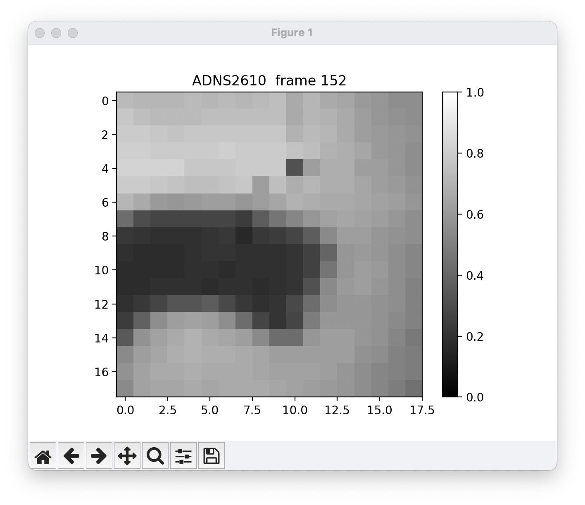
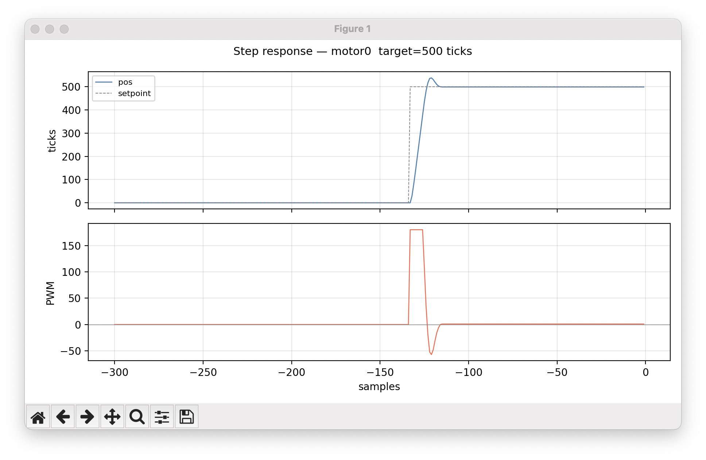

# UniProto — Multi-Setup Sensor Streaming Library

## Quick start

```bash
# build one target
pio run -e dc_motor

# build + upload
pio run -e dc_motor -t upload

# open monitor
pio device monitor -e dc_motor --baud 115200

# then in the monitor:
?                     # list capabilities
!stream:3             # enable stream 3
!rate:50              # set 50 Hz
!motor0.enable:1
!motor0.kp:2.0
!motor0.set:400
```

## Project layout

```
platformio.ini          ← one [env] per setup
lib/
  uniproto/             ← UniProto + UniWriter  (core, never edit for setups)
  modules/              ← mod_*.h / mod_*.cpp   (shared hardware drivers)
src_<setup>/
  main.cpp              ← wiring + registerWith() calls only
readers/
  plot_*.py             ← per-setup Python visualisers
  sensorhost/           ← browser visualiser (index.html + sketch.js)
  example.py            ← template for new readers
```

## Setup table

| env | hardware | board | modules used | compiles | hardware ok | visualiser |
|-----|----------|-------|--------------|----------|-------------|------------|
| `bldc_servo` | BLDC + standard ESC, 50 Hz PWM | Uno | Servo lib | ⬜ | ⬜ |
| `pneumatic` | pump + valve + Honeywell pressure + HX711 | Uno | mod_adc, inline HX711 | ⬜ | ⬜ |
| `stepper` | MKS SERVO42D closed-loop | Uno | step/dir, mod_adc | ⬜ | ⬜ |
| `load_cell` | HX711 24-bit ADC | Uno | inline HX711 | ⬜ | ⬜ |
| `psd_distance` | Sharp GP2Y0A710 | Uno | mod_psd | ✅ | ✅ | `plot_psd_distance.py`
| `dc_motor` | 1:30 geared DC + encoder, Motor Shield | Uno | mod_motors | ⬜ | ⬜ |
| `haptic` | 2× Maxon mini + L293 | Uno | mod_motors | ✅ | ✅ | `plot_dual_motor.py`
| `optical_mouse` | A2610 optical mouse sensor | Uno | mod_adns2610 | ✅ | ✅ | `plot_adns_picture.py`, `plot_adns_motion.py`
| `lvdt` | LVDT, PWM AC out, filtered AC in | Uno | mod_adc | ⬜ | ⬜ |
| `sensor_shield` | SensorShield (INA122, hall-enc, cap) | Uno | mod_adc, mod_motors | ⬜ | ⬜ |
| `bldc_gimbal` | BLDC gimbal + AS5600 + M5 DRV11873 | Uno | mod_bldc | ⬜ | ⬜ |
| `qtr8` | QTR-8 optical reflection array | Uno | mod_adc | ⬜ | ⬜ |
| `biosensors` | Grove GSR + ear-clip HR | Uno | mod_adc | ⬜ | ⬜ |
| `wind_speed` | optical gate wind sensor | Uno | mod_adc | ⬜ | ⬜ |
| `piezo_midi` | 4× piezo + MIDIUSB | **Leonardo** | mod_adc, MIDIUSB | ⬜ | ⬜ |
| `cap_sense` | variable capacitor, 10 MΩ RC | **Duemilanove 168** | inline | ✅ | ✅ | `plot_cap_sense.py`
| `kitchen_scales` | load cell + HX711 | Uno | inline HX711 | ⬜ | ⬜ |
| `us_distance` | HC-SR04 ultrasonic | Uno | inline | ⬜ | ⬜ |
| `accelerometer` | MMA7260 3-axis analog | Uno | mod_adc | ⬜ | ⬜ |
| `synchro` | 3-phase synchro transformer | Uno | mod_adc | ⬜ | ⬜ |
| `wiimote` | Wiimote IR camera via I2C | Uno | inline I2C | ⬜ | ⬜ |

⬜ untested  ✅ ok  ❌ broken  ⚠️ partial


## Sensor notes & captures

### optical_mouse — ADNS2610



18×18 pixel grayscale frame from the A2610 optical mouse sensor. Captured via
stream 7 in binary mode, reassembled from 6 chunks of 54 pixels each.
One stuck-high pixel at (10, 4) is a known sensor artefact on this unit —
not a communication error (confirmed: pixel stays bright with lens covered).

**Visualiser:** `readers/plot_adns_picture.py --continuous`  
Stream 6 = motion (dx, dy). Stream 7 = frame capture (trigger with `!adns.capture:1`).

---
### haptic — dual Maxon motor (plot_dual_motor.py)



Clean step response to 500 ticks (1 revolution): ~5% overshoot, single correction
pulse, settled. Kp=1.5, pwm_lim=180, no Ki/Kd needed for basic positioning.
Bidirectional haptic coupling via `!motor.link:3`.

---
## Adding a new setup

1. `mkdir src_mysetup`
2. Create `src_mysetup/main.cpp` — include needed modules, call `registerWith(proto)`
3. Add `[env:mysetup]` block to `platformio.ini` with `build_src_filter`
4. If new hardware needs a module, add `lib/modules/mod_mydevice.h/.cpp`

## UniProto command reference

| command | effect |
|---------|--------|
| `?` | print capabilities JSON |
| `?key` | get param value |
| `!key:value` | set param |
| `@action` | trigger action |
| `!stream:N` | enable only stream N |
| `!stream:+N` | enable stream N (additive) |
| `!stream:0` | disable all streams |
| `!rate:50` | set 50 Hz emit rate |
| `!format:csv` | CSV output (default) |
| `!format:ap` | Arduino Serial Plotter |
| `!format:txt` | human-readable debug |
| `!timestamp:1` | prepend ms timestamp |

## Readers

```bash
cd readers

# macOS port is typically /dev/tty.usbmodem*  — find yours with: ls /dev/tty.usb*
# Linux port is typically /dev/ttyUSB0 or /dev/ttyACM0

python plot_psd_distance.py   --port /dev/tty.usbmodemXXXX
python plot_motor_stream.py   --port /dev/tty.usbmodemXXXX
python plot_adns_picture.py   --port /dev/tty.usbmodemXXXX --continuous
```

> **macOS backend note:** readers use `matplotlib.use("MacOSX")`.
> If you run under PlatformIO's embedded Python (`~/.platformio/penv/`)
> do not use `TkAgg` — tkinter is not bundled there.

## TODO / planned modules

- `lib/modules/mod_hx711.h/.cpp` — shared HX711 driver (currently inlined in 3 setups)
- `lib/modules/mod_hc_sr04.h`   — HC-SR04 as proper module
- `lib/modules/mod_wiimote.h`   — Wiimote IR camera module