# UniProto — sensor streaming for Arduino

UniProto is a tiny serial protocol, an Arduino library and a set of Python visualisers. Every
sensor or actuator in this repository — from a capacitive slider to a BLDC gimbal — speaks the
same few text commands, so a new setup is a short sketch plus a plotter, never a new protocol.
Built for the *Mastering Tinkering* and *Social Robot Design* courses at the University of Twente.

- **One protocol, many setups.** Enable a stream, set a rate, change a parameter: the same commands everywhere.
- **Firmware stays small.** A sketch registers *streams*, *parameters* and *actions*; the library does parsing, timing and formatting.
- **Readers are plain Python.** Each setup has a matplotlib (or browser) visualiser; anything that can read a serial port works too.

## Pick a setup

Click an icon to jump to its section.

<!-- GRID:START -->
<table>
<tr>
<td align="center" valign="top" width="16%"><a href="#bldc-gimbal"><br><b>BLDC gimbal</b></a><br><sub>FOC haptic knob</sub></td>
<td align="center" valign="top" width="16%"><a href="#bldc-servo">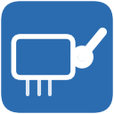<br><b>BLDC servo</b></a><br><sub>ESC, 50 Hz PWM</sub></td>
<td align="center" valign="top" width="16%"><a href="#dc-motor"><br><b>DC motor</b></a><br><sub>PID position / velocity</sub></td>
<td align="center" valign="top" width="16%"><a href="#dual-motor"><br><b>Dual motor</b></a><br><sub>haptic master-slave</sub></td>
<td align="center" valign="top" width="16%"><a href="#stepper">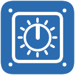<br><b>Stepper</b></a><br><sub>MKS SERVO42D</sub></td>
<td align="center" valign="top" width="16%"><a href="#pneumatic">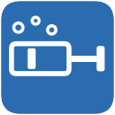<br><b>Pneumatic</b></a><br><sub>pump + pressure</sub></td>
</tr>
<tr>
<td align="center" valign="top" width="16%"><a href="#lvdt">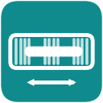<br><b>LVDT</b></a><br><sub>AC position sensor</sub></td>
<td align="center" valign="top" width="16%"><a href="#synchro"><br><b>Synchro</b></a><br><sub>3-phase angle</sub></td>
<td align="center" valign="top" width="16%"><a href="#optical-mouse">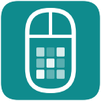<br><b>Optical mouse</b></a><br><sub>ADNS-2610 camera</sub></td>
<td align="center" valign="top" width="16%"><a href="#qtr8"><br><b>QTR-8</b></a><br><sub>line / gray-code strip</sub></td>
<td align="center" valign="top" width="16%"><a href="#accelerometer">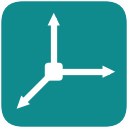<br><b>Accelerometer</b></a><br><sub>MMA7260, 3 axes</sub></td>
<td align="center" valign="top" width="16%"><a href="#wiimote"><br><b>Wiimote IR</b></a><br><sub>IR camera via I2C</sub></td>
</tr>
<tr>
<td align="center" valign="top" width="16%"><a href="#load-cell">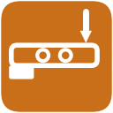<br><b>Load cell</b></a><br><sub>HX711 amplifier</sub></td>
<td align="center" valign="top" width="16%"><a href="#kitchen-scales"><br><b>Kitchen scales</b></a><br><sub>load cell + HX711</sub></td>
<td align="center" valign="top" width="16%"><a href="#cap-sense">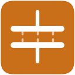<br><b>Cap sense</b></a><br><sub>variable capacitor</sub></td>
<td align="center" valign="top" width="16%"><a href="#psd-distance"><br><b>IR distance</b></a><br><sub>Sharp PSD</sub></td>
<td align="center" valign="top" width="16%"><a href="#us-distance">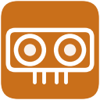<br><b>Ultrasonic</b></a><br><sub>HC-SR04 scope view</sub></td>
<td align="center" valign="top" width="16%"><a href="#sensor-shield">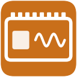<br><b>Sensor shield</b></a><br><sub>7 sensors, 1 board</sub></td>
</tr>
<tr>
<td align="center" valign="top" width="16%"><a href="#biosensors"><br><b>Biosensors</b></a><br><sub>GSR + heart rate</sub></td>
<td align="center" valign="top" width="16%"><a href="#wind-speed"><br><b>Wind speed</b></a><br><sub>optical anemometer</sub></td>
<td align="center" valign="top" width="16%"><a href="#piezo-serial">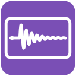<br><b>Piezo drums</b></a><br><sub>stream + heatmap</sub></td>
<td align="center" valign="top" width="16%"><a href="#piezo-midi"><br><b>Piezo MIDI</b></a><br><sub>USB-MIDI drum kit</sub></td>
<td align="center" valign="top" width="16%"><a href="#lidar"><br><b>Lidar</b></a><br><sub>2D laser scanner</sub></td>
<td align="center" valign="top" width="16%"><a href="#kinect"><br><b>Kinect</b></a><br><sub>depth camera</sub></td>
</tr>
</table>

<sub>Rows: 🟦 Motion & actuation  ·  🟩 Position & angle  ·  🟧 Force, touch & distance  ·  🟪 Bio, sound & vision</sub>
<!-- GRID:END -->

**Prefer clicking?** Start the launcher — a small Flask app that opens in your browser, shows this
same grid, has a serial-port box with suggestions, and starts the matching reader when you click an icon:

```bash
python readers/launcher.py                 # opens http://127.0.0.1:5050
python readers/launcher.py --check         # which reader scripts / icons exist?
python readers/launcher.py --flask-port 5051 --no-browser     # other web port, don't open a tab
```

It needs only `flask` and `pyserial` (both in `readers/requirements.txt`) — no tkinter. It listens on
this computer only (`127.0.0.1`) and starts nothing that is not listed in `readers/setups.py`.
The launcher starts each reader as its own process (a normal plot window) with `--port <port in the box>`. Only one reader
can hold a serial port at a time, so a second one is refused until the first window is closed
(use the window's **×** button — see [the Leonardo note](#troubleshooting)). Setups that have
several readers (sensor shield, optical mouse, …) list all of them in the row under the grid.
Raw-probe readers marked *debug* stay hidden until you tick **Show debug readers**, and a click never starts one.
Setups without a Python reader show a hint instead.

## Quick start

```bash
# 1. firmware (PlatformIO) — one environment per setup
pio run -e dc_motor -t upload
pio device monitor -e dc_motor           # optional: talk to it by hand

# 2. Python readers
cd readers
python -m venv .venv && source .venv/bin/activate      # Windows: .venv\Scripts\activate
pip install -r requirements.txt
python plot_dc_motor.py --port /dev/tty.usbmodem21201  # Windows: --port COM3
```

Details for macOS / Windows / Linux, finding your port and Linux permissions: [`readers/SETUP.md`](readers/SETUP.md).
Everything runs from the one virtual environment, including the launcher (Flask).

---

# How the stream library works

```
 Arduino sketch                              host (Python, serial monitor, …)
 ┌──────────────────────┐   text commands   ┌──────────────────────────┐
 │ UniProto             │ ◄──────────────── │  !stream:+1   !rate:50   │
 │  streams  (periodic) │                   │  !kp:2.0      @zero      │
 │  params   (get / set)│ ────────────────► │  1,684,672,684,30        │
 │  actions  (one-shot) │   data lines      │  (one line per tick)     │
 └──────────────────────┘                   └──────────────────────────┘
```

A sketch registers three kinds of things, all by name:

| Kind | What it is | Example |
|------|------------|---------|
| **stream** | a record emitted every tick while enabled | `pos, set, cmd, err, vel` of a motor |
| **param** | a value the host can read (`?key`) or write (`!key:value`) | `mot.kp`, `qtr.thr` |
| **action** | a one-shot command (`@name`) | `@mot.zero` |

## Commands

One command per line (newline terminated). Replies are `OK`, `key:value`, or `ERR <reason>`.

| Command | Meaning |
|---------|---------|
| `?` | capabilities as one JSON line: device name, every stream (`id`, `name`, `schema`, `units`), params, actions |
| `?rate` `?format` `?timestamp` `?stream` | read a core setting (`rate:50`; `stream:` lists the enabled ids, `0` if none) |
| `?key` | read a parameter → `key:value` |
| `!rate:N` | emit rate in Hz, clamped to 1–500. *Every enabled stream is emitted once per tick.* |
| `!format:csv` `txt` `ap` `bin` | output format (below) |
| `!timestamp:0\|1` | prefix each record with the time since boot |
| `!stream:N` | enable **only** stream N · `!stream:+N` add · `!stream:-N` remove · `!stream:0` all off |
| `!key:value` | set a parameter |
| `@action[:args]` | run an action |

Errors you may see: `ERR no-such-param`, `ERR set-failed`, `ERR get-failed`, `ERR set-missing-colon`,
`ERR bad-format`, `ERR no-such-action`, `ERR unknown-cmd`. Lines may be at most 63 characters on AVR boards (`UNIPROTO_CMD_BUF`): a longer line overflows the buffer,
the front is discarded and the tail is parsed as a separate — usually bogus — command. `\r` is ignored, so CRLF is fine.

## Output formats

| `!format:` | Looks like | For |
|------------|------------|-----|
| `csv` (default) | `684,672,684,30` — values only, comma separated, one line per stream per tick | Python readers |
| `ap` | `raw:684,pos:12` — `key:value` pairs | Arduino Serial Plotter |
| `txt` | human-readable debug text | typing by hand |
| `bin` | binary frames (below) | image / block data |

**CSV carries no stream id.** With `!timestamp:1` each line starts with the time since boot in
**seconds** (3 decimals). If a reader has to tell two streams apart, see the design rules below.

### Binary frame (`!format:bin`)

```
AA 55 | stream id (u8) | flags (u8) | payload length (u16, little-endian) | [timestamp u32 ms, if flags & 1] | payload
```

Fields inside the payload are raw little-endian `u16` / `i32` / `float32` in the order the sketch
writes them. The sketch must pass the exact payload length to `begin(sid, len)`; fields that would
overflow it are silently dropped. `bytes()` (blocks, e.g. camera pixels) only exists in binary mode —
in CSV it is ignored. The optical-mouse reader ([`plot_adns_picture.py`](readers/plot_adns_picture.py)) is a complete example.

## Design rules we converged on

These came out of debugging real setups (the long version is in [`docs/context.md`](docs/context.md)):

1. **One stream = one record type, and never enable two same-width streams the reader can't tell apart.**
   Interleaved streams of equal field count get swapped the moment a line is dropped. Either put everything
   in one wide stream (piezo: `A0..A3,dA0..dA3`) or start every record with an explicit id (sensor shield).
2. **Stream raw values, derive in Python.** The QTR-8 sends 8 raw decay times; binary, gray code and line
   position are computed in the reader. Pre-computed streams exist for consumers without a PC.
3. **Slow sensors never block the emit callback.** Poll them in `loop()` into cached variables; the callback only copies.
4. **Namespace parameters** by device: `foc.k`, `mot.kp`, `qtr.thr`, `us.rate`.
5. **Readers parse first, filter later.** Try `float()` on every field and skip the line on `ValueError`;
   banners, `OK` and `ERR` lines then fall out naturally.

## Writing a sketch

```cpp
#include <Arduino.h>
#include "UniProto.h"

UniProto proto(Serial, "MySensor");

static void emitRaw(UniProto&, uint8_t sid, UniFrameWriter& w, void*) {
    w.begin(sid);                      // for bin: w.begin(sid, payloadBytes)
    w.u16(analogRead(A0), "raw");      // keys are only used by ap / txt
    w.f32(millis() / 1000.0f, "t", 3); // value, key, decimals
    w.end();
}

static bool getParam(UniProto&, const char* k, char* out, size_t n, void*) {
    if (!strcmp(k, "my.gain")) { snprintf(out, n, "%.2f", (double)gain); return true; }
    return false;
}
static bool setParam(UniProto&, const char* k, const char* v, void*) {
    if (!strcmp(k, "my.gain")) { gain = UniProto::parseFloat(v); return true; }
    return false;
}
static bool doZero(UniProto&, const char*, const char*, Stream& out, void*) {
    zero(); out.println(F("zeroed")); return true;
}

void setup() {
    Serial.begin(115200);
    proto.begin();
    proto.setRateHz(50);
    proto.registerStream({1, "raw", "u16,f32", "adc,s", emitRaw, nullptr});
    proto.registerParam ({"my.gain", UniProto::ParamType::FLOAT, getParam, setParam, nullptr});
    proto.registerAction({"my.zero", doZero, nullptr});
}
void loop() { proto.tick(); }
```

Then add a `[env:mysetup]` block (copy any existing one) and `src_mysetup/main.cpp`.

**Gotchas**

- The writer has `u16`, `i32`, `f32` and `bytes` — **no `u32`**. Microsecond timestamps fit `i32` for ~35 minutes; send them relative to session start.
- The `schema` / `units` strings are only printed by `?`; nothing parses them.
- Limits are compile-time: `UNIPROTO_MAX_STREAMS` (default 8), `UNIPROTO_MAX_PARAMS` (16), `UNIPROTO_MAX_ACTIONS` (8) — raised per environment with `build_flags` in `platformio.ini`.
  Streams are enabled through a 16-bit mask over registration order, so at most 16 streams per sketch.
- A blocking sensor read (ultrasonic `pulseIn`, capacitive sensing) delays the whole tick — see rule 3.

## Writing a reader

```python
import serial, time
ser = serial.Serial(PORT, 115200, timeout=0)
time.sleep(2)                                  # Uno / Duemilanove reset when the port opens
for cmd in ("!format:csv", "!timestamp:0", "!rate:50", "!stream:+1"):
    ser.write((cmd + "\n").encode()); time.sleep(0.15)
ser.reset_input_buffer()

buf = b""
while True:
    buf += ser.read(ser.in_waiting or 1)
    while b"\n" in buf:
        line, buf = buf.split(b"\n", 1)
        try:
            vals = [float(v) for v in line.decode().split(",")]
        except ValueError:
            continue                           # OK / ERR / banner lines
        print(vals)
```

For plotters: call `plt.pause(0.005)` **unconditionally** at the bottom of the loop (inside an `else` it starves the GUI),
keep the `Button` objects in a list (otherwise they are garbage-collected and stop responding), and use
`x.max() - x.min()` instead of `x.ptp()` (removed in NumPy 2). Add `import uniproto_backend  # noqa` before
`matplotlib.pyplot` to get the right backend on every OS.

## Project layout

```
platformio.ini            one [env] per setup (board, libraries, build flags)
lib/uniproto/             UniProto + UniWriter                    (the library)
lib/modules/              mod_*.h/.cpp — reusable hardware drivers (motors, ADNS-2610, HX711, …)
src_<setup>/main.cpp      wiring + registerWith() calls          (one folder per setup)
readers/
  setups.py               the list of setups: names, readers, groups   ← launcher, icons and README grid read this
  launcher.py             click-to-start launcher (Flask, opens in the browser)
  plot_*.py               per-setup visualisers (the *_debug ones are raw probes)
  plot_adc_blocks.py      generic viewer for binary ADC-block streams (not tied to one setup)
  sensorhost/             browser host (Web Serial, Chrome/Edge): open index.html
  example.py              template for a new reader
  uniproto_backend.py     picks the matplotlib backend per OS
  requirements.txt  SETUP.md
tools/
  make_icons.py           draws docs/icons/*.png from setups.py
  update_readme_grid.py   rebuilds the grid above; --check reports README drift
docs/
  icons/                  128 px tiles (README) and sm/ 96 px tiles (launcher)
  context.md              technical decisions and debugging log
  bldc_gimbal.md          BLDC gimbal manual
```

**Adding a setup:** add a `Setup(...)` entry to `readers/setups.py`, a glyph to `tools/make_icons.py`, and an
`<a id="…"></a>` section below; then run `python tools/make_icons.py` and `python tools/update_readme_grid.py`
(`--check` tells you what is missing). To use a photo instead of a drawn icon, drop a PNG with the same file name into `docs/icons/` and `docs/icons/sm/`.

---

# Setups

Status: ✅ documented · 🚧 stub (hardware listed, details to follow). No Python reader yet: bldc_servo, stepper, pneumatic, wiimote (use `pio device monitor`); piezo_midi is a MIDI device and needs none.

<a id="bldc-gimbal"></a>
## BLDC gimbal — `bldc_gimbal` ✅

Field-oriented control of a gimbal motor as a programmable haptic knob: spring, detents, damper, or a sweep.
**Hardware:** DRV8313 LittleFOC driver · AS5600 magnetic encoder · BDUA 2204 motor (7 pole pairs) · Uno.
**Firmware:** `src_bldc_gimbal/` — a minimal FOC written for this repo (SimpleFOC does not fit the Uno's 32 KB). All three phases run at 62.5 kHz.
**Wiring:** pins 9, 10, 11 → DRV8313 IN1–IN3 · pin 8 → EN · A4/A5 → AS5600 SDA/SCL.
**Reader:** `plot_bldc_gimbal.py` · full manual: [`docs/bldc_gimbal.md`](docs/bldc_gimbal.md)

| Param | Default | Meaning |
|-------|---------|---------|
| `foc.enable` | 0 | 1 = drive the motor |
| `foc.mode` | 1 | 0 open loop · 1 spring · 2 detents · 3 damper · 4 spring + damper · 5 sweep |
| `foc.k` | 2.0 | spring stiffness (V/rad) |
| `foc.b` | 0.3 | damping |
| `foc.vlimit` | 2.0 | maximum torque voltage — **start low** |
| `foc.poles` | 7 | motor pole pairs |
| `foc.sweep_hz` | 0.5 | sweep rate, positive = clockwise |
| `@foc.zero` | | zero the position here |

Bring-up: `!stream:1` → `!rate:20` → `!foc.enable:1` → `!foc.mode:5` → `!foc.sweep_hz:0.5`. Check that clockwise and counter-clockwise sweeps feel the same, then switch to spring mode.
If the spring pushes instead of pulls, swap two motor phase wires.

<a id="bldc-servo"></a>
## BLDC servo — `bldc_servo` 🚧

BLDC motor on a standard ESC, driven with 50 Hz servo PWM, no position feedback. Board: Uno. Firmware: `src_bldc_servo/`.

<a id="dc-motor"></a>
## DC motor — `dc_motor` ✅

A 12 V geared DC motor under position, velocity or direct-PWM control, with a potentiometer as setpoint.
**Hardware:** 12 V DC motor · 1:30 gearbox · US-Digital 100 PPR quadrature encoder on the rear shaft · Arduino Motor Shield (L298P) · Uno.
**Wiring:** motor on shield **channel B** — PWM pin 11 (Timer 2, ~31 kHz), DIR pin 13, BRAKE pin 8 · encoder A → pin 2, B → pin 3 (both interrupts) ·
setpoint pot on **A3 = GND, A4 = signal, A5 = VCC**. *Do not use A0/A1: the shield uses them for current sense.*
**Counts:** 100 PPR × 4 × 30 = **12 000 counts per output revolution**.
**Stream 1 `mot`:** `pos, set, cmd, err, vel, mA` (motor current from A1, 2.96 mA per ADC count).
**Reader:** `plot_dc_motor.py` — position / velocity / PWM+error / current charts and a control panel.

| Param | Default | Meaning |
|-------|---------|---------|
| `mot.enable` | 1 | controller on (starts enabled) |
| `mot.mode` | 1 | 0 direct PWM · 1 position PID · 2 velocity PID |
| `mot.kp` `mot.ki` `mot.kd` | 2.0 · 0 · 0 | PID gains (velocity mode needs very different values than position mode) |
| `mot.pwm_lim` | 100 | PWM ceiling, 0–255 — raise gradually |
| `mot.set` | | setpoint in ticks (pos) or counts/s (vel); the pot overwrites it every 50 ms |
| `mot.pot_scale` | 12000 | full pot travel in ticks (position mode) |
| `mot.vel_scale` | 20000 | full pot travel in counts/s (velocity mode) |
| `mot.vel_alpha` | 0.5 | velocity filter, 1 = off, smaller = smoother (velocity is measured over 20 ms windows) |
| `mot.ctrl_hz` | 500 | control-loop rate — `!mot.ctrl_hz:50` shows students what a 10× slower loop does |
| `@mot.zero` `@mot.brake` `@mot.coast` | | zero the encoder · engage / release the brake |

<a id="dual-motor"></a>
## Dual motor (haptic) — `haptic` ✅

Two coupled motors for master–slave haptics: move one and the other follows (and pushes back).
**Hardware:** two Maxon motors with encoders · L293 driver · Uno. **Env:** `haptic` (firmware `src_haptic/`, driver `mod_motors`).
**Stream 3:** `pos0, pos1, set0, set1, cmd0, cmd1, err0, err1`.
**Commands:** `!stream:3`, `!motor0.enable:1`, `!motor0.kp:1.5`, `!motor0.set:500`, `!motor0.pwm:100`, `!motor0.pwm_lim:180`, `!motor.link:3` (bidirectional coupling), `!motor.link_scale:0.5`, `@motor.zero`, `@motor.stop`.
**Readers:** `plot_haptic_dual_motor.py` — strip charts plus a command panel with presets ·
`plot_dual_motor.py` — the same monitor with a scrolling window of 100–2000 samples drawn from a larger circular history (`--history`), **rec** (live CSV log) and **save buffer** (dump the history to CSV) ·
`plot_haptic_dual_motor_stream.py`, `plot_haptic_dual_motor_stream_vel.py` (adds a velocity estimate) ·
`plot_haptic_dual_motor_debug.py` (*debug*: raw probe that shows what the Arduino sends).

<a id="stepper"></a>
## Stepper — `stepper` 🚧

MKS SERVO42D closed-loop stepper controller driven with step/dir signals. Board: Uno. Firmware: `src_stepper/`.

<a id="pneumatic"></a>
## Pneumatic — `pneumatic` 🚧

Pump and valve with a Honeywell pressure sensor read through an HX711. Board: Uno. Firmware: `src_pneumatic/`.

<a id="lvdt"></a>
## LVDT — `lvdt` 🚧 *(waveform view still being verified)*

Linear variable differential transformer: a core sliding through a primary coil changes how the two secondary coils balance.
**Wiring:** pins 9 and 10 output a filtered-PWM sine in **anti-phase** (≈100 Hz) and drive the primary · the two secondaries, in series opposition, go to **GND and A1** (optional series capacitor).
**Baud:** 38 400 (the 5 kHz timer interrupt is timing critical).
**Streams:** 1 `lvdt.pos` — position −1…+1 from correlating the received signal with the excitation (amplitude = distance from centre, phase = side) ·
2 `lvdt.frame` — the raw capture: `id, off, cnt, s0…s(cnt-1)` per line (480 samples = 10 cycles, in chunks).
**Param / action:** `lvdt.scale` · `@lvdt.zero`. **Reader:** `plot_lvdt.py` — full-frame oscilloscope, single-cycle zoom, position chart and bar.

<a id="synchro"></a>
## Synchro — `synchro` 🚧 *(known issue)*

Three-phase synchro transformer: the rotor angle is recovered from a filtered-PWM sine sent on three phases.
**Wiring:** phases on pins 9 (0°), 5 (120°) and 10 (240°) · receiver on **A1**. Timer 2 interrupt at 5 kHz, 48-sample sine table, frames of 480 samples (10 cycles) sent in chunks of 60. **Baud 115 200** (the reader's default).
Angle comes from cross-correlation. **Known issue:** the angle is still erratic because the ISR's capture array can be read while it is being written; double-buffering is planned.
**Reader:** `plot_synchro.py`.

<a id="optical-mouse"></a>
## Optical mouse — `optical_mouse` ✅

An ADNS-2610 optical-mouse sensor read over its bit-banged serial interface (A4/A5): relative motion, or a 18×18 pixel image of the surface.
**Board:** Uno · module `mod_adns2610`.
**Streams:** 6 `adns.motion` — `dx, dy` · 7 `adns.frame` — the image, in chunks of `id, w, h, off, n` + `n` six-bit pixels (binary format).
**Params:** `adns.led` (illumination), `adns.capture` (`1` grabs one frame), `adns.motion_on` (`0` frees bandwidth during an image read), `adns.resync`; read-only diagnostics `adns.dx dy squal maxpix minpix pixsum shutter status`, and `adns.w adns.h adns.chunk_px`.
**Readers:** `plot_adns_picture.py` (image; pass `--continuous` to keep refreshing, `--flip_x` / `--flip_y` to mirror) · `plot_adns_motion.py` (dx/dy trace) · `plot_adns_debug.py` (*debug*: raw probe).

<a id="qtr8"></a>
## QTR-8 reflectance array — `qtr8` ✅

Eight infrared reflectance sensors (Pololu QTR-8RC) under a vehicle, or over a strip: line following, or a gray-code position encoder.
**Board:** Arduino Duemilanove, ATmega328P (`diecimilaatmega328`). **Wiring:** sensors on digital pins **4–11**, 5 V.
All eight are read in parallel by timing how long each RC node takes to discharge: short = white, long = black (timeout 2500 µs = full black).

| Stream | Content | For |
|--------|---------|-----|
| 1 `raw` | 8 decay times in µs | everything — the Python reader derives the rest |
| 2 `bin` | 8 × thresholded 0/1 | use without Python |
| 3 `line` | line position 0–255 | line follower without Python |
| 4 `gray` | gray-code pattern 0–255 | position strip without Python |

**Params:** `qtr.thr` (binary threshold, µs, default 1000), `qtr.timeout` (default 2500). **Action:** `@qtr.cal` (threshold from 50 samples).
**Reader:** `plot_qtr8.py` — heat-map squares, binary squares with their binary and gray-code value, raw decay charts with the threshold, and a bottom chart (tick boxes) with binary value, gray code and line position, all 0–255.
**Line position** is a pure weighted centroid, `Σ(i·raw[i]) / Σ raw[i]`, scaled to 0–255 — no threshold, so it moves smoothly as the line crosses between sensors.
**Gray code:** `gray = bin ^ (bin >> 1)` — one bit changes per step, which is what you want on a 256-position paper strip.

<a id="accelerometer"></a>
## Accelerometer — `accelerometer` ✅

MMA7260 three-axis analog accelerometer. **Wiring:** X = A0, Y = A1, Z = A2 · SLEEP = pin 2 (high = active) · GS1 = pin 3, GS2 = pin 4 select the range (both low = ±1.5 g, the default; GS1 high = ±2 g; GS2 high = ±4 g; both high = ±6 g). Board: Uno. **Reader:** `plot_accelerometer.py`.

<a id="wiimote"></a>
## Wiimote IR camera — `wiimote` 🚧

The Wiimote's infrared camera on I²C at 400 kHz. Board: Uno. Compiles; the camera initialisation sequence still needs verifying on hardware.

<a id="load-cell"></a>
## Load cell — `load_cell` ✅

Single HX711 amplifier, channel A, gain 128. **Wiring:** DOUT = A3, SCK = A2. Board: Uno. **Reader:** `plot_load_cell.py`.
**Calibration:** 1. flash and open the reader · 2. remove all weight, click **zero** (tare) · 3. place a known weight · 4. enter it, click **calc scale** · 5. click **verify**.

<a id="kitchen-scales"></a>
## Kitchen scales — `kitchen_scales` ✅

The same HX711 module as the load cell, wired differently (DOUT = A1, SCK = A0) and calibrated for 0–5000 g. Board: Uno.
**Readers:** `plot_kitchen_scales.py`; calibrate with `plot_load_cell.py` using the procedure above.

<a id="cap-sense"></a>
## Capacitance sensing — `cap_sense` ✅

A variable capacitor (~200 pF) measured through a 10 MΩ resistor. **Wiring:** SEND = A3 (charges through the resistor), SENSE = A0.
**Board:** Arduino Duemilanove with ATmega168 — only 14 KB flash, so keep this sketch lean.
**Modes (`!cap.mode`):** 0 = analog voltage after a fixed charge delay (best for small C, default) · 1 = count-to-threshold (better for larger C). `!cap.delay:200` sets the charge delay in µs for mode 0.
**Reader:** `plot_cap_sense.py`.

<a id="psd-distance"></a>
## IR distance (Sharp PSD) — `psd_distance` 🚧

Sharp GP2Y0A710 analog infrared distance sensor via `mod_psd`. Board: Uno. Reader: `plot_psd_distance.py`.

<a id="us-distance"></a>
## Ultrasonic distance — `us_distance` ✅

An HC-SR04 shown as an **oscilloscope**: see the 10 µs trigger pulse, the echo pulse that follows, and how the gap between them shrinks as an object approaches — or vanishes on a time-out.
**Wiring:** TRIG = pin 3, ECHO = pin 2 (interrupt). **Board:** Uno.
**Streams:** 1 `pulse` — `trig_us, echo_us, echo_dur, cm` (timestamps in µs since session start; `echo_dur` 0 and `cm` −1 mean time-out) · 2 `dist` — `cm` only.
**Params:** `us.rate` (1–20 Hz, default 10), `us.timeout` (µs, default 30 000 ≈ 5 m).
**Reader:** `plot_us_distance.py` — trigger and echo traces with a **timebase** from 100 µs to 500 ms (zoom in to see the acoustic gap, out to see the pulse train), a distance chart and a large readout.

<a id="sensor-shield"></a>
## Sensor shield — `sensor_shield` ✅

One board, seven sensors, seven streams — a tour of the typical analog and digital sensor interfaces.
**Power:** the shield runs at **3.3 V** while the Uno's ADC reference is 5 V, so shield signals span 0–675 counts and the Hall mid-point is 338 (`ADC_MID`, `ADC_SHIELD_FS` at the top of `main.cpp` — change them if you power it at 5 V).
**Library:** CapacitiveSensor (installed by PlatformIO).

| Pin | Sensor | Notes |
|-----|--------|-------|
| A0 | potentiometer | also the RC-ADC reference |
| A1 | external input J1 | switchable AC/DC |
| A2 | foil pressure sensor | 100 k pull-up, inverse calibration |
| A3 | strain gauge | via INA122 amplifier, 500 g full scale |
| A4, A5 | Hall sensors | two phases → rotation angle (9 magnets, 270°) |
| D2, D3 | quadrature encoder | 5 kHz timer interrupt |
| D4 | RC-ADC | 100 k + 100 nF to A0, charge and discharge timed |
| D6, D7, D11 | capacitive slider | |
| D8, D12 | HC-SR04 | trigger, echo — range ~10 m |

**Streams** (each record starts with its own id so the reader can tell them apart): 1 analog A0–A5 · 2 foil, strain · 3 hall angle · 4 encoder · 5 capacitive slider · 6 RC-ADC · 7 ultrasonic.
**Readers:** `plot_sensor_shield.py` (everything on one page) · `plot_sensor_shield_flask.py` (same, in the browser at `http://localhost:5000`) · `plot_sensor_shield_weight.py` (foil vs strain as an XY hysteresis plot) · `plot_sensor_shield_angle.py` (potentiometer vs Hall angle — a straight line if both sit on one shaft). In the XY plots press **`c`** to clear the trail.

<a id="biosensors"></a>
## Biosensors — `biosensors` ✅

Grove GSR (skin conductance, **A0**) and an ear-clip heart-rate sensor (**A5**). Board: Uno. **Reader:** `plot_biosensors.py`.
GSR is a slow signal — use **auto-fit** after attaching the electrodes. BPM is the average over the last 8 beats.

<a id="wind-speed"></a>
## Wind speed — `wind_speed` ✅

An optical-gate anemometer: an IR LED (A2/A3) and photodiode (A0/A1) count fan blades. Board: Uno.
**Params:** `wind.thr` (pulse threshold, default 512), `wind.blades` (default 3), `wind.circ` (fan circumference in m, default 0.05).
**Readers:** `plot_wind_speed.py` (**auto (midpoint)** sets the threshold from the live signal).

<a id="piezo-serial"></a>
## Piezo drums (serial) — `piezo_serial` ✅

Four piezo plates on **A0–A3** as drum pads, streamed for visualisation. **Board: Arduino Leonardo.**
**Stream 1:** `A0, A1, A2, A3, dA0, dA1, dA2, dA3` — raw ADC plus an IIR-smoothed **derivative** (`d = (1-s)·d + s·(raw - prev)`, `s` = `piezo.smooth`, default 0.7).
Trigger on the derivative, not the raw value: it ignores baseline drift, crosstalk and slow voltage build-up.
**Reader:** `plot_piezo_serial.py` — raw charts, derivative charts with the threshold, and four impact circles that glow with hit strength; each pad plays a synthesised kick, snare or hi-hat (pygame, no sound files; `--nosound` to disable). Buttons adjust the threshold and smoothing.
Drum map: A0 kick · A1 snare · A2 closed hi-hat · A3 open hi-hat.

<a id="piezo-midi"></a>
## Piezo MIDI — `piezo_midi` ✅

The same four pads, but the Leonardo appears as a **USB-MIDI device**: a hit sends a note-on (velocity from the peak) on channel 10. No reader — open a Drum Rack in Ableton or any GM drum synth.

| Pad | Note | Drum |
|-----|------|------|
| A0 | 36 | kick |
| A1 | 38 | snare |
| A2 | 42 | closed hi-hat |
| A3 | 46 | open hi-hat |

Remap by editing `NOTES[]` in `src_piezo_midi/main.cpp`. Library: MIDIUSB. Tune `THRESHOLD`, `PEAK_WINDOW` and `RETRIGGER` at the top of the sketch; use `piezo_serial` first to see what your pads actually deliver.

<a id="lidar"></a>
## Lidar — `lidar` 🚧

2D laser scanner. Python only (no Arduino firmware).

<a id="kinect"></a>
## Kinect — `kinect` 🚧

Depth camera. Python only (no Arduino firmware).

---

# Troubleshooting

- **No data / `Port busy`.** Only one program can open a serial port. Close the Arduino IDE's serial monitor, the PlatformIO monitor and any other reader first.
- **Leonardo / piezo reader hangs after the first run.** The Leonardo sketch waits (`while(!Serial)`) for DTR to rise. On macOS the OS can leave DTR high after a program ends, so the next run sees no edge. `plot_piezo_serial.py` opens the port with DTR low → high and drops DTR again on close — which happens reliably only when you close the window with its **×** button — Ctrl-C can interrupt before DTR is dropped. Always close with ×.
- **macOS shows two ports per board** (`/dev/tty.usb…` and `/dev/cu.usb…`). The readers were developed with `tty.`; the launcher lists those first.
- **Launcher: "Address already in use".** Another program has web port 5050 — start it with `--flask-port 5051`. (5000 is avoided on purpose: macOS uses it for AirPlay.)
- **A reader says "not found" in the launcher.** Run `python readers/launcher.py --check`, then fix the script name in `readers/setups.py`.
- **A reader dies immediately from the launcher.** The status line shows the last line of its error; the complete output is in `<temp dir>/uniproto_launcher/<script>.log`.
- **Plots lag or freeze on a slow machine.** Lower `!rate:`, and for the dual-motor reader watch the `draw` and `rx` numbers in its status line: rising `draw` means plotting is the bottleneck, rising `rx` means the serial data is not being consumed fast enough.
