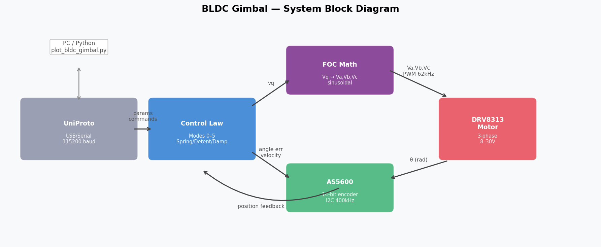
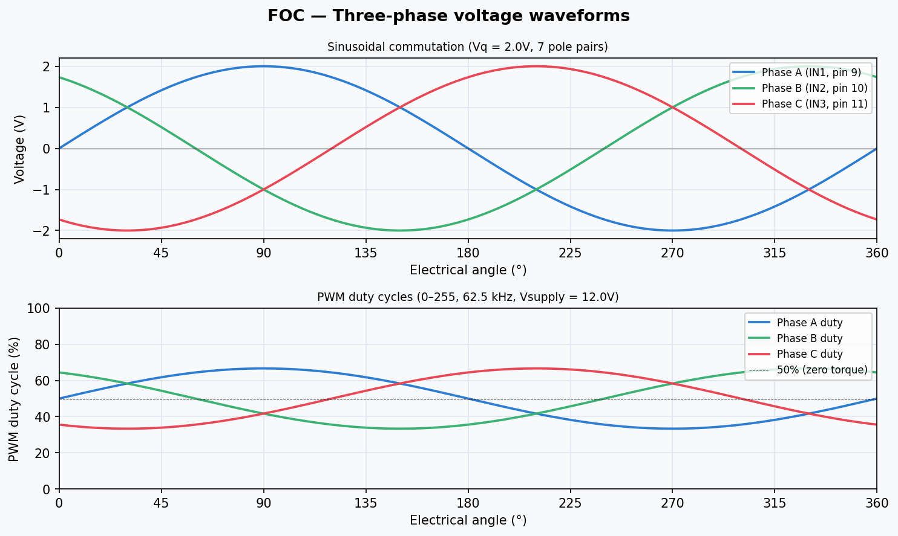
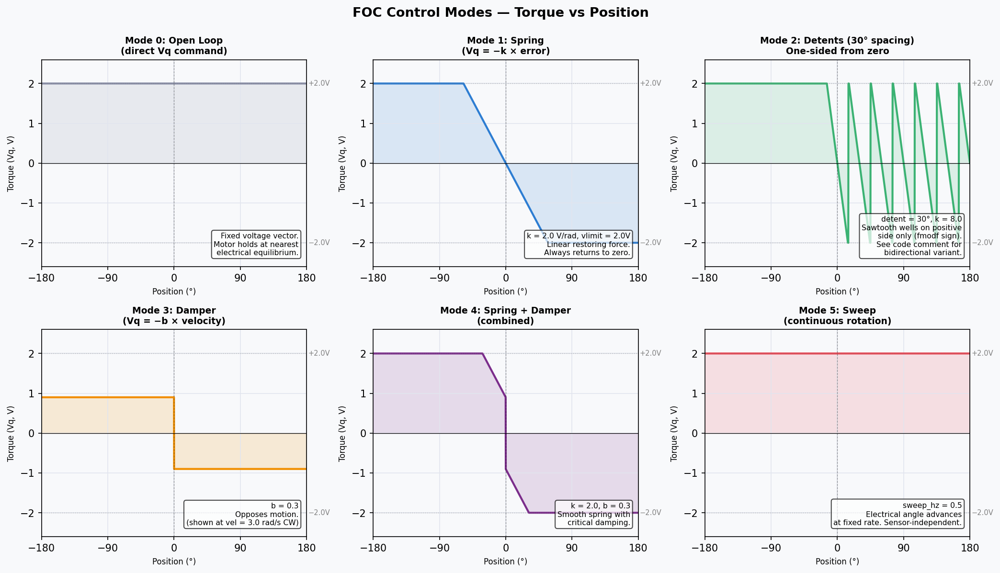

# BLDC Gimbal Motor — Setup & Operation Manual

This document describes the hardware setup, firmware architecture, and operation
of the BLDC gimbal motor haptic controller built with a DRV8313 three-phase
driver, AS5600 absolute magnetic encoder, and a custom minimal FOC implementation
running on Arduino Uno.

---

## Hardware

### Components

| Component | Part | Notes |
|---|---|---|
| Motor | BDUA 2204 gimbal motor | 7 pole pairs, >10Ω winding resistance |
| Driver | LittleFOC board (DRV8313) | 3-PWM input, 8–30V motor supply |
| Encoder | AS5600 | 12-bit absolute magnetic, I2C |
| Magnet | 4mm diametric disc | Mounted centred on motor shaft |
| Controller | Arduino Uno | ATmega328P, custom minimal FOC |

### Wiring

```
Arduino         LittleFOC (DRV8313)     Motor
─────────────────────────────────────────────────
Pin 9  ──────── IN1                     Phase A (M1)
Pin 10 ──────── IN2                     Phase B (M2)
Pin 11 ──────── IN3                     Phase C (M3)
Pin 8  ──────── EN (enable, HIGH=active)
5V     ──────── SLEEP (always active)
5V     ──────── RESET (never reset)
GND    ──────── GND
[8–30V]──────── VCC (motor supply)

Arduino         AS5600
─────────────────────
A4     ──────── SDA
A5     ──────── SCL
3.3V   ──────── VCC
GND    ──────── GND
[diametric magnet centred on shaft above sensor]
```

> **Note:** SLEEP and RESET on the LittleFOC board have onboard pull-up
> resistors — leave unconnected. Only EN needs to be driven from Arduino.

---

## System Architecture



The system has three layers:

1. **UniProto** handles USB serial communication at 115200 baud. The Python
   visualiser sends parameter updates (`!param:value`) and reads the streaming
   telemetry (position, velocity, effort, raw encoder count).

2. **Control law** computes the torque demand `Vq` from the current position
   error and velocity, according to the selected control mode (0–5).

3. **FOC math** converts `Vq` and the electrical angle into three sinusoidal
   PWM voltages that drive the DRV8313 half-bridges.

### FOC Implementation

Field Oriented Control in voltage mode:

```
θ_elec = −angle × pole_pairs        (negated to match phase wiring)

Va = Vq × sin(θ_elec)
Vb = Vq × sin(θ_elec + 120°)
Vc = Vq × sin(θ_elec + 240°)

PWM = (V / Vsupply + 0.5) × 255    clamped to 0–255
```



The three phases are generated at **62.5 kHz** (Timer1 ICR1=255, Timer2
prescale=1) — well above the audible range, giving silent operation. All
three phases use identical 0–255 PWM range to ensure symmetric torque in
both rotation directions.

### Encoder

The AS5600 ANGLE register (0x0C) gives a 12-bit value (0–4095) per
revolution. The firmware reads this via I2C at 400 kHz on every loop
iteration. The raw reading is unwrapped into a continuously accumulating
`_angle` variable using shortest-arc differencing:

```cpp
diff = raw - _prev;                        // may wrap
while (diff >  π) diff -= 2π;             // unwrap to ±π
while (diff < -π) diff += 2π;
diff = -diff;                              // CW = positive angle
_angle += diff;
```

`_angle` starts at 0 on every power-on (the first reading initialises
`_prev`, making the first `diff ≈ 0`). Use `@foc.zero` to re-zero at any
time during operation.

---

## Control Modes



### Mode 0 — Open Loop

```
Vq = foc.vq    (constant, set by user)
```

The electrical angle is fixed at `foc.theta`. The motor snaps to the
nearest stable electrical position and holds. Used for diagnostics and
pole-pair counting: count the number of stable positions per mechanical
revolution — that number is your pole pairs.

### Mode 1 — Spring

```
Vq = −k × (angle − set)
```

Linear restoring force proportional to angular displacement from `foc.set`.
Force is unbounded — the motor will pull back from any number of full
revolutions. Increase `foc.k` for a stiffer spring, `foc.vlimit` for more
maximum torque.

### Mode 2 — Detents

```
phase = (angle − set + detent/2) mod detent − detent/2
Vq = −detent_k × phase
```

Creates repeating sawtooth potential wells spaced `foc.detent` radians
apart (default 30° = π/6). The motor clicks between fixed positions like
a mechanical encoder. `foc.detent_k` controls the sharpness of each click.

### Mode 3 — Damper

```
Vq = −b × velocity
```

Opposes angular velocity in both directions, creating a viscous drag
sensation. Works symmetrically for CW and CCW. Use with mode 4 for a
critically damped spring, or alone for a smooth flywheel feel.

### Mode 4 — Spring + Damper

```
Vq = −k × (angle − set) − b × velocity
```

Combines spring restoring force with velocity damping. With appropriate
`foc.b`, eliminates oscillation on release (critically damped). Start
with `b ≈ 0.3` and increase until overshoot disappears.

### Mode 5 — Sweep

```
θ_elec advances at sweep_hz electrical revolutions/sec
```

Continuous rotation test. Positive `foc.sweep_hz` = CW, negative = CCW.
The motor rotates continuously at a rate controlled by `sweep_hz`,
independent of the position sensor. Used to verify the driver and wiring
before tuning closed-loop modes.

---

## Quick Start

### 1. Flash firmware

```bash
pio run -e bldc_gimbal -t upload
```

### 2. Launch visualiser

```bash
python readers/plot_bldc_gimbal.py --port /dev/tty.usbmodemXXXX
```

### 3. Verify encoder

Stream position without enabling the motor. Turn the shaft by hand and
confirm `pos` increases CW and decreases CCW.

### 4. Test sweep (open-loop rotation check)

```
enable → mode 5 sweep → ▶ 0.5
```

Motor should spin CW at a steady rate. `◀ −0.5` should spin CCW at the
same speed. If CW and CCW speeds differ, adjust `foc.ph` (phase offset)
in ±π/4 increments until they match.

### 5. Spring mode

```
mode 1 spring → @foc.zero → k 2.0 → vlimit 2V
```

Turn the rotor and release — it should spring back to zero smoothly from
any position in either direction. If it spins away instead of returning,
swap any two motor phase wires (M1 ↔ M2) and reflash.

---

## Parameter Reference

| Parameter | Default | Description |
|---|---|---|
| `foc.enable` | 0 | 0=off, 1=on (also drives EN pin) |
| `foc.mode` | 1 | Control mode 0–5 (see above) |
| `foc.poles` | 7 | Motor pole pairs |
| `foc.vsupply` | 12.0 | Motor supply voltage (V) |
| `foc.vlimit` | 2.0 | Max torque voltage (V), start low |
| `foc.k` | 2.0 | Spring stiffness (V/rad) |
| `foc.b` | 0.3 | Damping coefficient (V·s/rad) |
| `foc.set` | 0.0 | Spring/detent setpoint (rad) |
| `foc.detent` | 0.5236 | Detent spacing (rad), default 30° |
| `foc.detent_k` | 8.0 | Detent well stiffness |
| `foc.vq` | 2.0 | Open-loop torque command (V) |
| `foc.theta` | 0.0 | Open-loop fixed electrical angle (rad) |
| `foc.sweep_hz` | 0.5 | Sweep rate (elec. rev/s), +ve=CW |
| `foc.ph` | 0.0 | Electrical phase offset for symmetry tuning |
| `foc.pos` | — | Read-only: current angle (rad) |

### Actions

| Action | Description |
|---|---|
| `@foc.zero` | Reset `_angle` and `_set` to 0 at current position |

---

## Tuning Guide

### Finding pole pairs

Use mode 0 (open loop):
```
!foc.mode:0
!foc.vq:2.0
!foc.enable:1
!foc.theta:0.0
```
Count how many stable positions you feel per full revolution. That number
is your pole pairs. Alternatively: enable sweep and compare how far the
shaft moves per electrical revolution (`foc.theta` from 0 to 2π).

### Spring feel

| Parameter | Effect |
|---|---|
| `foc.k` ↑ | Stiffer, snappier return |
| `foc.vlimit` ↑ | More maximum force |
| `foc.b` ↑ | More damping, less oscillation |
| `foc.k` > 5 with low `foc.b` | Oscillation / instability |

Start: `k=2.0, vlimit=2.0, b=0.3`. Increase `k` to taste, then increase
`b` if oscillation appears.

### Detent feel

| Parameter | Effect |
|---|---|
| `foc.detent` | Spacing between clicks (rad) |
| `foc.detent_k` ↑ | Sharper, more defined click |
| `foc.vlimit` ↑ | Stronger holding force in each well |

Common detent spacings: 30° = 0.5236 rad, 45° = 0.7854 rad, 
15° = 0.2618 rad.

---

## Troubleshooting

| Symptom | Likely cause | Fix |
|---|---|---|
| Motor spins to infinity in spring mode | Wrong torque sign | Swap two motor phase wires |
| N stable points in open-loop (mode 0) | Wrong pole pairs | `!foc.poles:N` |
| CW and CCW sweep speeds differ | Phase waveform asymmetry | Adjust `!foc.ph:0.785` etc. |
| Audible hum | PWM frequency too low | Check Timer1/2 setup in firmware |
| Cogging, snapping at fixed intervals | Natural motor cogging | Normal; reduce vlimit if severe |
| Spring works one way, not the other | `_start_offset` bug (old firmware) | Update to latest firmware |
| Encoder only spans π/2 per revolution | Wrong magnet type | Use diametric disc magnet |
| AS5600 not found (WARN on boot) | I2C wiring error | Check SDA/SCL, pull-ups |